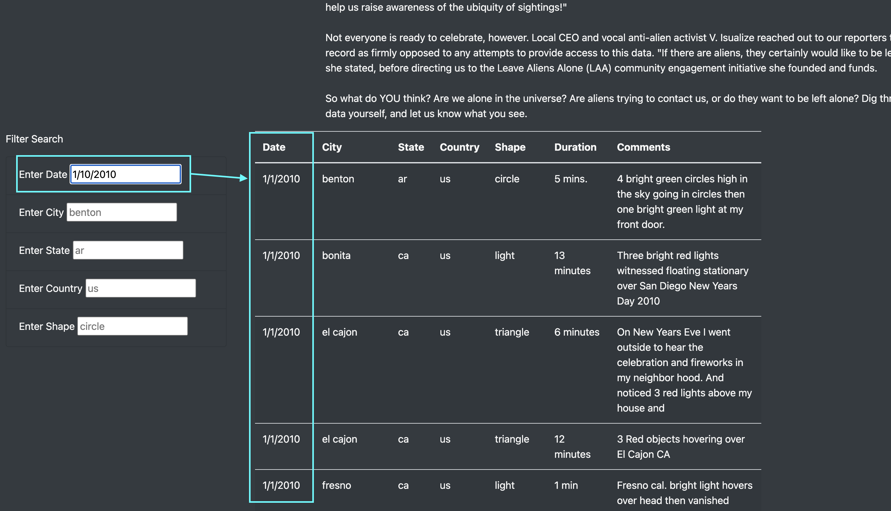

# UFOs

## Overview
The purpose of this analysis is to display UFO sightings. The website allows the user to filter throught the UFO sighting data. The user can use these filters to see the UFO data relevant to their studies. 

## Results 
The user can access the UFO finder website and enter filter criteria in the filter form. Upon entering text into the form inputs, the table of UFO sightings will automatcially update. If the user clears thier input, the filter will clear. 

## Summary 
One of the drawbacks of these design is speed. If the UFO sightings were a larger data set, loading and filtering the data could become slow. Another drawback is the user cannot add UFO sightings. Without fresh data, this site will quickly become irrelevant.
